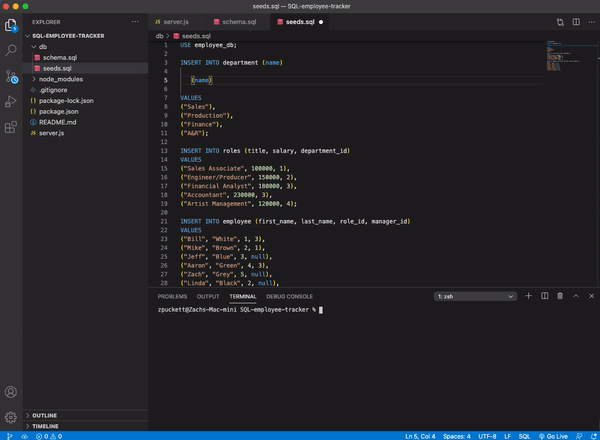

# SQL-employee-tracker
A command-line application for managing a company's employees. Access to create departments, add job roles, and new employees. This is done by using node, inquirer, and MySQL. 

# Prerequisites 

This application requires the following NPMs: mySQL, Inquirer, and Console Table. 

# Installing

npm install mysql
 
npm install inquirer
 
npm install console.table

# Built With

Visual Studio Code - Application code.

# Working Application 

* https://youtu.be/eMcv20zAdi0

## Made with :heart: by Zach Puckett!

